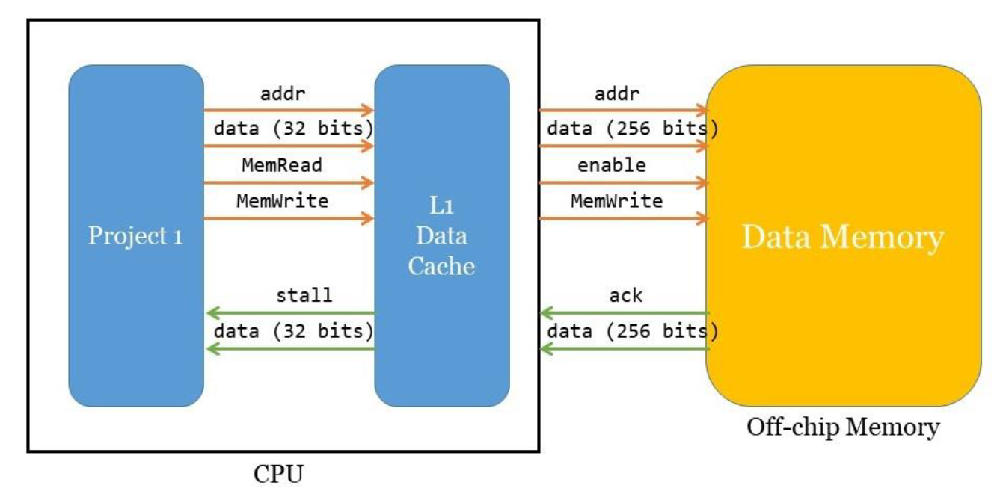

# Verilog implementation of a RISC-V pipelined-CPU with a L1 cache

## System Architecture

### L1 Data Cache Specs

- Size: 1KB

- Associative: 2 way

- Replacement policy: LRU

- Cache line size: 32 Bytes

- Write hit policy: write back

- Write miss policy: write allocate

## Supported Instructions

- and rd, rs1, rs2 (bitwise and)

- xor rd, rs1, rs2 (bitwise exclusive or)

- sll rd, rs1, rs2 (shift left logically)

- add rd, rs1, rs2 (addition)

- sub rd, rs1, rs2 (subtraction)

- mul rd, rs1, rs2 (multiplication)

- addi rd, rs1, imm (addition)

- srai rd, rs1, imm (shift right arithmetically)

- lw rd, imm(rs1) (load word)

- sw rs1, imm(rs2) (store word)

- beq rs1, rs2, imm (branch)

Instructions should be convert into RISC-V machine code format for CPU input.
